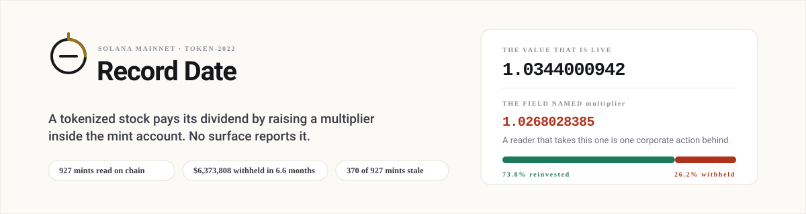

<div align="center">



<br>

**Tokenized stocks pay dividends invisibly, 30% short, and at hours no market is open.**

<a href="https://iamrobertmoore.github.io/record-date/desk.html"><b>Settlement desk</b></a> &nbsp;·&nbsp;
<a href="https://iamrobertmoore.github.io/record-date/"><b>Evidence page</b></a> &nbsp;·&nbsp;
<a href="https://explorer.solana.com/address/ycg2obpKmccwAz1zGf4QqgV2vnkWd6CQKLdJSGDxtmG?cluster=devnet"><b>Program on devnet</b></a> &nbsp;·&nbsp;
<a href="docs/architecture.svg"><b>Architecture</b></a> &nbsp;·&nbsp;
<a href="#reproduce-it">Reproduce the numbers</a>

<a href="https://github.com/iamrobertmoore/record-date/actions/workflows/ci.yml"></a>

</div>

---

**1026 mints read on chain · 663 activations timed against the exchange's own calendar · 386 of 1,026 mints where the obvious field is the wrong one · 1,026 of 1,026 confirmed against the runtime · 56 tests · 33 checks · 99 negative controls**

Every number in this file comes out of the build. If one drifts, the 33 checks stop the page from being written, and the 99 controls prove each check can actually fail.

---

## Check it yourself in five minutes

| Claim | How | What you should see |
|---|---|---|
| 1026 mints read, 386 carrying the wrong value in the obvious field | `python3 scripts/fetch.py` | `1026 agreed, 0 disagreed, 0 published nothing to compare against` |
| The live value is the one the runtime applies, on every mint | `python3 scripts/fetch.py` | `supply witness: 1026 agreed, 0 disagreed` |
| Every figure on this page matches the build | `python3 scripts/build_page.py` | exits 0, or names the figure it wanted and writes no page |
| The checks themselves can fail | `python3 scripts/test_checks.py` | `99 of 99 as expected`, no network needed |
| The deployed program is the tested binary | `cat docs/deploy.txt` | `deployed ELF identical to the tested binary` |
| The program answers a question | [Settlement desk](https://iamrobertmoore.github.io/record-date/desk.html) | both sides of the window, and a hold or settle verdict |
| The record is on chain | [Program on devnet](https://explorer.solana.com/address/ycg2obpKmccwAz1zGf4QqgV2vnkWd6CQKLdJSGDxtmG?cluster=devnet) | the `Receipt` accounts the program wrote |

---

## What this is

**A tokenized stock doesn't pay its dividend in cash. It quietly raises a `multiplier` stored inside its Token-2022 mint account.** The mint keeps two multipliers and no more: the one from before the last change, and the new one beside it with the time it takes effect. The trap is the naming. **On 386 of 1,026 mints the field named `multiplier` is not the multiplier.** It's the old value. Read it, and you're one corporate action behind.

I didn't guess that from the field names. It's what Token-2022's own `process_update_multiplier` does, and I checked it against the issuer's published current value on every single mint: **1026 agreed, 0 disagreed, 0 published nothing to compare against**. Then I checked it against Solana itself, because the runtime applies the multiplier when it answers `getTokenSupply` and the issuer can't fake that: **1,026 of 1,026 mints agree with the runtime's own `getTokenSupply`**. Both are build checks, so the page won't build if either ever stops being true.

**Meet Tomas.** He holds about $9,000 of tokenized US stocks in a Solana wallet. He's not a trader; he bought them because they pay dividends and settle in seconds. In March, May and August the issuer reinvested his XOMx dividend, and each time it took 30% for tax first. He never saw any of it, because Token-2022 leaves the raw balance alone and expects whoever reads it to apply the multiplier. **Record Date is the reader that applies the right one, and the program that keeps the record the mint throws away.**

Tomas isn't the only one exposed. A lending market that takes xStocks as collateral values them by multiplying the balance by whatever the mint says, so the wrong field misprices the loan the moment a dividend lands. And the issuer's own docs ask trading venues to pause for fifteen minutes either side of every activation. Nothing enforces that.

---

## The proof, on one real mint

XOMx, the Exxon Mobil xStock, read straight from its mint account on mainnet:

| | |
|---|---|
| the field named `multiplier` | **1.0130866** |
| the live value, in force since 2026-08-15 00:30 UTC | **1.0176490** |
| a 100-share position, as a wallet reading the obvious field shows it | **101.31** |
| the same position, as the mint actually holds it | **101.76** |

**Two numbers in one account, and the one with the obvious name is a dividend behind.** The issuer's feed for the same stock shows $3.09 a share paid gross and $2.163 reinvested. That's **$0.927 a share withheld at 30%**, $112,965 across the float, and nothing in any holder's wallet mentions it. The [settlement desk](https://iamrobertmoore.github.io/record-date/desk.html) opens on this mint and reads it live, and every xStock the issuer has moved is on the live board underneath.

**The biggest gap isn't a dividend at all.** It's a split: on NFLXx the field named `multiplier` reads **1** while the chain has applied **10** since 2025-11-16. Anyone reading the obvious field values that position at a tenth of what it's worth, and **4** mints are off by a factor of two or more. Splits land through the same two fields as dividends, at the same hour, and the settlement window this program answers is exactly the check that would have caught it.

---

## Try it

| Try this | What you'll see |
|---|---|
| [Open the settlement desk](https://iamrobertmoore.github.io/record-date/desk.html) | Pick any xStock: the field named `multiplier` against the live value, what your wallet shows against what you own, the dividends reinvested, what was withheld at 30%, and a hold or settle verdict. Below it, a live board of every moved xStock, and the deployed program answering the same question on devnet |
| [Open the evidence page](https://iamrobertmoore.github.io/record-date/) | Every figure in this file, with the freshest reconciliations and the gap against the market by age |
| [Fetch NVDAx's multiplier history](https://api.xstocks.fi/api/v2/public/assets/NVDAx/multiplier/history?page=0&pageSize=5&network=Solana) | The issuer's own record of each activation, old and new multiplier side by side, no API key |
| [Open the program on devnet](https://explorer.solana.com/address/ycg2obpKmccwAz1zGf4QqgV2vnkWd6CQKLdJSGDxtmG?cluster=devnet) | The deployed program, its IDL, and the `Receipt` accounts it writes, **each activation on chain as a crank** writes it |

---

## How big the problem is

**403 of the 430 tokenized stocks on Solana that publish a withholding rate lose 30% of every dividend before it is reinvested. Over 6.8 months of the issuer's own feed that's $6,873,017 withheld, about $12,128,854 a year, and no holder's wallet shows a cent of it.** Of that, $25,311,277 of the $26,756,904 gross is dated on or before today and $1,445,628 is still forward. I report both rather than netting them off.

The multiplier reinvests the **net** dividend, not the gross, and everything else rests on that, so I tested it. Divide the per-share cashflow by the multiplier step and you should get the share price. With the net figure it lands on the market at **1.036**. With the gross it reads **1.480**. The 41 zero-rate events, where net and gross are the same number, act as the control.

**And the dividends don't arrive while anyone is trading.** Of 663 activations, **654 fall outside the US regular session as the exchange itself defines it**, and **59 of them take effect on a day the market does not trade at all**. This matters because of where the volume is: the Solana Foundation's 13 September newsletter reports that **63% of tokenized-equity volume settles outside US market hours**. The issuer asks venues to pause for fifteen minutes around each activation. It's a request, not a rule.

---

## The business

**The program is free and permissionless. Record Date sells the feed.** One subscription per integrating protocol, **$500 a month**, covering every xStock that protocol lists on Solana. The buyer is a venue or lender that can't afford to settle inside a window the issuer only recommends pausing for, and today has no record to check.

**The protocol pays, not the holder.** It grows with every issuer that ships an equity token on Token-2022, since one subscription covers them all with no new integration, and with every protocol that lists one. The first two integrations are free.

---

## How it uses Solana

Six pieces, and each one earns its place. **Take any one away and either the mechanism disappears or the number is just the issuer agreeing with itself.**

| # | Piece | Why it matters | Where |
|---|---|---|---|
| 1 | Token-2022 `ScaledUiAmountConfig`, both multipliers | the whole trap is that two fields exist and the obvious one is named `multiplier` | `programs/record_date/src/token2022.rs:71` |
| 2 | Picking the live multiplier from the activation timestamp | without it, every reader is one corporate action behind | `programs/record_date/src/token2022.rs:98` |
| 3 | The Anchor program: the record and the window | without it, there's no history to read and no verdict to act on | `programs/record_date/src/lib.rs:53`, `programs/record_date/src/lib.rs:76` |
| 4 | A Pyth `PriceUpdateV2` account read inside the program | without it, the price is the issuer agreeing with itself | `programs/record_date/src/instructions/verify_against_pyth.rs:46` |
| 5 | Pyth's published exchange calendar | the timing finding uses the exchange's definition of open, not one I picked | `scripts/fetch.py:241` |
| 6 | The desk builds its transactions in the browser | anyone can ask the deployed program, with no key, no backend and no library | `scripts/desk_template.html:1446` |

`bind_pyth_feed` stores the feed id against a registered mint rather than the price account's address, because a `PriceUpdateV2` account is rewritten on every publish and its address isn't stable.

---

## When the dividends land

The issuer publishes when each activation lands. As far as I can tell nobody had counted them by the minute, so I did. **663 activations**, from every symbol that pays a dividend and has a price, by the minute of the day they take effect:

| Time (UTC) | Activations | New York clock |
|---|---:|---|
| 00:30 | 427 | 20:30 ET the previous day |
| 23:55 | 177 | 19:55 ET, after the close |
| 00:15 | 11 | 20:15 ET the previous day |
| 01:15 | 5 | 21:15 ET the previous day |

**654 of the 663, or 98.6%, fall outside the US regular session as the exchange itself defines it, and 93.5% of them land on those four minutes.**

I measured it two ways so the answer doesn't depend on where I drew the line. A deliberately generous UTC window, 13:00 to 21:00, still leaves 651 of the 663 outside. The exchange calendar Pyth publishes in its keyless feed directory (`America/New_York`, 09:30 to 16:00, with twelve holiday and half-day overrides) puts 654 outside. The build requires both to agree.

The sharper number needs neither: **59 activations, 8.9% of the sample, take effect on a day the market does not trade at all.** On those days the stock is shut all day and the token isn't.

Nobody's code is broken here. Activations are scheduled for 00:30 UTC the day after the ex-date: four and a half hours after the US close, thirteen before the next open. The fifteen-minute pause is all that stands in for a market, and it lives in a document, not a program. **A mint account can't enforce it, which is why this entry ships a program instead of a warning.**

---

## Two price fields, and only one is a price

A tokenized stock on Jupiter carries two prices. `usdPrice` is the pool quote. `stockData.price` is a reference feed. They aren't interchangeable: on 2026-09-23 they **differed by more than 20% on **14** mints**. **The widest is a factor of **26****, on `Xsn3H7AC…`, where the pool quotes $395.01 against a reference of $15.09.

The reconciliation settles which one is a real price, and it doesn't use a price at all. Across **465 reconciliations on 366 names**, `net ÷ step` lands on the market at **1.036** while the gross reads **1.480**. The gap grows with the age of the activation, which is exactly what you'd expect:

| Age of the activation | Events | Median gap against today's price |
|---|---:|---:|
| 0 to 2 days | 6 | 0.4% |
| 3 to 10 days | 56 | 2.9% |
| 11 to 30 days | 151 | 4.9% |
| 31 to 60 days | 158 | 6.8% |
| over 60 days | 94 | 6.5% |

**385 of the 413 tokens priced here carry a past activation timestamp, median age 26.4 days.** The build tests the gradient as **2.8% within ten days against 6.5% beyond sixty**.

---

## The reference price isn't always in dollars

The field ExDate recommends is the right one. Taking it at face value is the next mistake.

**174 of the 1,026 mints track a stock that doesn't trade in dollars.** The reference feed quotes those in the stock's own currency, and London listings come through in **pence**. So a FTSE share shows up at roughly **75 times** its dollar price: the exchange quotes pence and the feed passes that on as if it were pounds. On this build every one of the 57 is published at **74.8 times** its dollar price. That's 100 divided by the GBP rate, the same for every share, which is why it's one number and not a range.

Taken at face value, the 913 priced mints are worth **$24.21bn**. Converted from each stock's own currency at the ECB reference rate for 2026-09-22, they're worth **$7.05bn**. The London listings are **3.30% of the book** by value, and **3.30% of the converted book** accounts for the entire difference: read pence as dollars and that slice gets multiplied by 75. It matters beyond a market value nobody trades on, because **yields are divided by these prices**. A book that is **3.44 times too large** reports a yield 3.44 times too small, and a plausible-looking yield is the one nobody questions.

---

## What's on chain

The program is live on devnet at `ycg2obpKmccwAz1zGf4QqgV2vnkWd6CQKLdJSGDxtmG`, with eight instructions. `register_mint` stores the live multiplier **next to** the value in the field the mint calls `multiplier`, so the gap is out in the open. `record_activation` is permissionless and writes a `Receipt` whenever the multiplier moves: old value, new value, the issuer's timestamp and the raw supply, in order and never edited. `read_entitlement` converts raw units into the units a wallet should show, in integer maths throughout. `activation_pending` returns a single byte, so a cranker never pays for a transaction that would revert.

**`settlement_window` exists because of the timing finding.** It returns two numbers: seconds since the last activation, and seconds until one the issuer has staged. `-1` means nothing to report, because `0` is a real answer and means 1970. **The mint carries a timestamp a program can read, and no history.** It keeps the value from before the last change and the latest one, and everything earlier is gone. EquityGuard branches on that timestamp directly with no price feed. But while a new value is staged, the mint's only timestamp describes the value that *hasn't* arrived yet. The window returns both halves, and the second is something the mint can't express at all.

**A receipt's `effective_at` is the issuer's own timestamp, and it can be 0.** The issuer stages the next multiplier about four hours ahead, and staging overwrites the timestamp of the value currently in force. A crank that lands in that window records the change it can see and dates it `0`. Measured on SATAx: the issuer staged its next value at 20:20:17Z for `2026-09-17T00:30:00Z`, so for 4h 09m 43s the mint carried a timestamp that hadn't arrived.

**The caller sets how old a Pyth price may be, not the program.** A venue settling during the session might want a minute; one settling a weekend corporate action has to accept Friday's close. So the program enforces a one-day ceiling and lets the caller choose anything below it. Sampling the live AAPL account ten times over three minutes on 2026-09-17, it advanced its `publish_time` **nine times** and was never more than **24 seconds** old. The devnet AAPL fixture tests the staleness refusal because it really was **33.6 days** old when captured.

**The program reads the mint as raw bytes rather than through the `spl-token-2022` crate.** It doesn't link against the program that owns the mint, and the real layout isn't quite the one the docs describe. The header position is computed rather than searched for, and **asserted on all 1026 live mints: the padding is zero in 1,026 of 1,026, the account-type byte is 1 in 1,026 of 1,026, and the `ScaledUiAmountConfig` header is at byte 275 in all 1026.** `tests/mints/` holds the 927 mint accounts that existed on 17 September as raw bytes, and `tests/walk_census.rs` walks every one on a plain `cargo test` with no network: **927 accounts, 927 walked, 0 refused, body offset 279 on every one.** The parser is also tested on a real account, `fixtures/nvdax_mint.bin`, and `cargo clippy --all-targets -- -D warnings` is clean and wired into `scripts/deploy.sh`, so a warning blocks a deploy. And two multipliers are never compared as floats: `TokenRecord` keeps the raw bits of both values and every decision compares a `u128` fixed point, because `0.0 == -0.0` is true and `NaN != NaN` is true.

---

## The Pyth track

This entry is built for **Best use of Pyth market data**. The track asks builders to *"work with both the underlying market and the on-chain asset representing exposure to it"*, and that comparison is what this entry is built on. Both halves are wired up.

**The feed is bound on chain.** `bind_pyth_feed` stores the id `Equity.US.AAPL/USD` against a registered mint, and `verify_against_pyth` reads a `PriceUpdateV2` account owned by Pyth's receiver program. Pyth is used inside a Solana program, not next to one. **The other half is the mint itself.** Pyth is checked against the mint's own value, which is what makes the check mean something, because on 386 of the 1,026 mints the field named `multiplier` and the live value disagree.

---

## Scope

- **One issuer.** 1026 mints from Backed's own asset API: every xStock it publishes on Solana.
- **The devnet record holds demo activations.** The read rule is proven on all 1026 real mints; feeding the on-chain record from them is first on the roadmap.
- **The annual figure is scaled up** from 6.8 months of the issuer's feed, so treat it as an order of magnitude.

**Built on:** the read rule is in Solana's Token-2022 documentation, and **ExDate** published the withholding rate and a dollar total on 13 September 2026. **Kamino**'s Scope oracle suspends a price for the 24 hours before an activation. Record Date adds the count, the timing against the exchange's own calendar, and the on-chain record.

## Roadmap

1. Deploy to mainnet and register real mints, so the record holds real corporate actions.
2. Run a cranker, so activations are written as they happen.
3. Two venue integrations, which is what the subscription is priced for.
4. Replace per-venue webhooks with a subscription a protocol can poll.
5. Add issuers beyond this one; the same subscription already covers them.

Corrections to earlier versions of this file are in [CORRECTIONS.md](CORRECTIONS.md).

---

## Reproduce it

```bash
# every number on the page, from public endpoints, with no key
python3 scripts/fetch.py          # writes data.json, asserts 33 checks
python3 scripts/build_page.py     # writes index.html, after checking the hand-written figures

# the checks themselves
python3 scripts/test_checks.py    # 99 negative controls, no network needed
```

`fetch.py` takes about ten minutes, most of it the two passes over all 1026 mints: one against the issuer, one against the runtime. If a price moves while it runs, `build_page.py` names the figure that moved and writes no page; just run the fetch again.

```bash
# the program
anchor build --arch v1                                       # --arch v1 is required
cargo test --manifest-path programs/record_date/Cargo.toml   # 56 tests: 18 unit, 37 integration, 1 census
cargo clippy --manifest-path programs/record_date/Cargo.toml --all-targets -- -D warnings
scripts/deploy.sh devnet                                     # refuses to deploy a mismatched id
```

The binary on devnet is byte for byte the one the tests ran against: the deployed bytes match the built file, and everything after it is zero padding. `anchor build --arch v1` is required because LiteSVM can't load the default v3 ELF.

```
built            326696 bytes, sha256 fa4a700e3c304880
deployed         332952 bytes, 6256 of trailing padding
deployed ELF     identical to the tested binary
```

```bash
# the whole loop on devnet, against the deployed program, no mocks
npm install
npm run demo        # creates a mint, schedules a dividend, waits for it, cranks a receipt
npm run demo:status # read what is already on chain, change nothing
```

---

## Sources

All public, none need a key.

| | |
|---|---|
| mint list, currency and venue | `https://api.xstocks.fi/api/v2/public/assets` |
| corporate actions | `https://api.xstocks.fi/api/v2/public/corporate-actions/upcoming` |
| multiplier, current and history | `https://api.xstocks.fi/api/v2/public/assets/{SYMBOL}/multiplier/history` |
| mint accounts | `https://api.mainnet-beta.solana.com` |
| prices | `https://api.jup.ag/price/v3` |
| exchange rates, for the non-dollar listings | `https://api.frankfurter.app/latest` (ECB reference rates) |
| the exchange calendar, for the timing claim | `https://hermes.pyth.network/v2/price_feeds` |
| a Pyth price account, for the on-chain check | `https://api.mainnet-beta.solana.com`, reading the `PriceUpdateV2` account itself |
| the pause recommendation | [docs.xstocks.fi/developers/multipliers](https://docs.xstocks.fi/developers/multipliers) |
| 63% of tokenized-equity volume outside market hours | [Solana Foundation newsletter, 13 September 2026](https://solanacompass.com/news/solana-tokenized-stocks-beat-nyse-and-nasdaq-combined-in-volume-with-63-of-trades-after-market-hours) |
| the venue that already branches on the activation timestamp | [Kamino governance forum](https://gov.kamino.finance/t/kamino-is-integrating-xstocks-powered-by-the-chainlink-data-standard-to-enable-tokenized-equities-lending/792), and [Scope's `chainlink.rs`](https://github.com/Kamino-Finance/scope/blob/master/programs/scope/src/oracles/chainlink.rs) |
| the read rule, in code | [`process_update_multiplier`](https://github.com/solana-program/token-2022/blob/main/program/src/extension/scaled_ui_amount/processor.rs) |
| the account layout, in code | [`interface/src/extension/mod.rs`](https://github.com/solana-program/token-2022/blob/main/interface/src/extension/mod.rs) |

Pyth shows up twice and neither use needs a key. Its **feed directory** is public, and the session definition above comes from it. Its **prices** reach a Solana program without a key because Pyth posts every update to Solana as a `PriceUpdateV2` account, and a posted account is public state. This repository never calls an HTTP price API.

**Prior art this builds on:** [ExDate](https://github.com/AlperJ/exdate) (the read rule, the withholding rate, the dollar total), [SolanaRWA](https://solanarwa.app) (per-holder dividend records on this chain since May 2026), [Kamino](https://gov.kamino.finance/t/kamino-is-integrating-xstocks-powered-by-the-chainlink-data-standard-to-enable-tokenized-equities-lending/792) (the 24 hour suspension), and [Lido's stETH reward history](https://stake.lido.fi/rewards) (the same mechanic on Ethereum since 2021).

**Neighbours in this event.** When I counted on 20 September, **27 of the 108 repositories** this hackathon had produced shipped an on-chain program. The four closest to this one: [EquityGuard](https://github.com/Maheshsiddu29/EquityGuard) (an `assert_safe_execution` guard reading the mint's activation timestamp, deployed on devnet 13 September), [DividendX](https://github.com/notorious-d-e-v/dividendx-stocklana), [KEEL](https://github.com/Marc-Dvci/KEEL), and [stockcurve](https://github.com/ExpertVagabond/stockcurve) (which reads the same keyless `PriceUpdateV2` account this entry does). **131 projects** had been submitted by 20 September; entries stay hidden until the close.

Built for **Stocklana**, by Robert Moore. MIT licensed.
